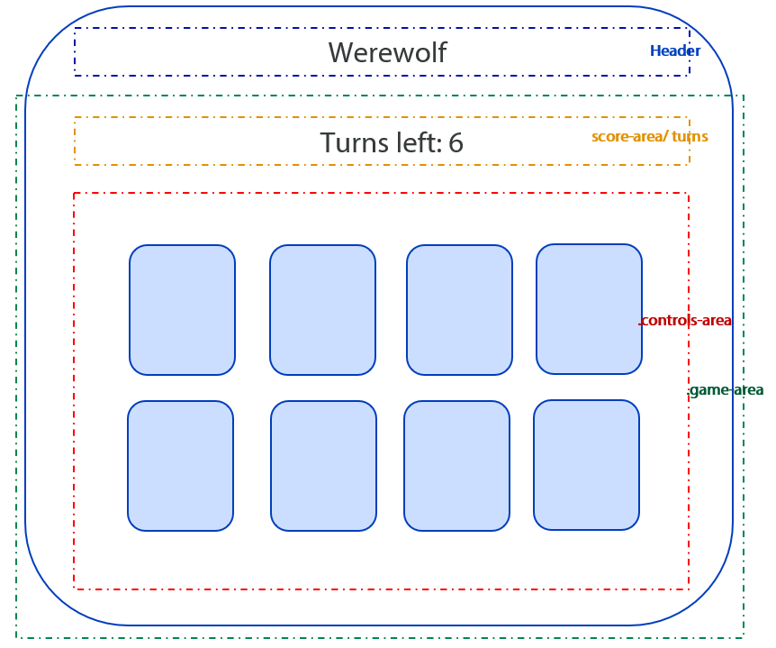
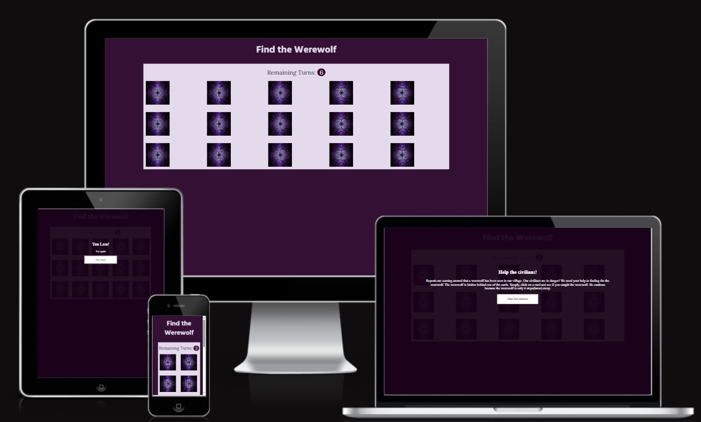
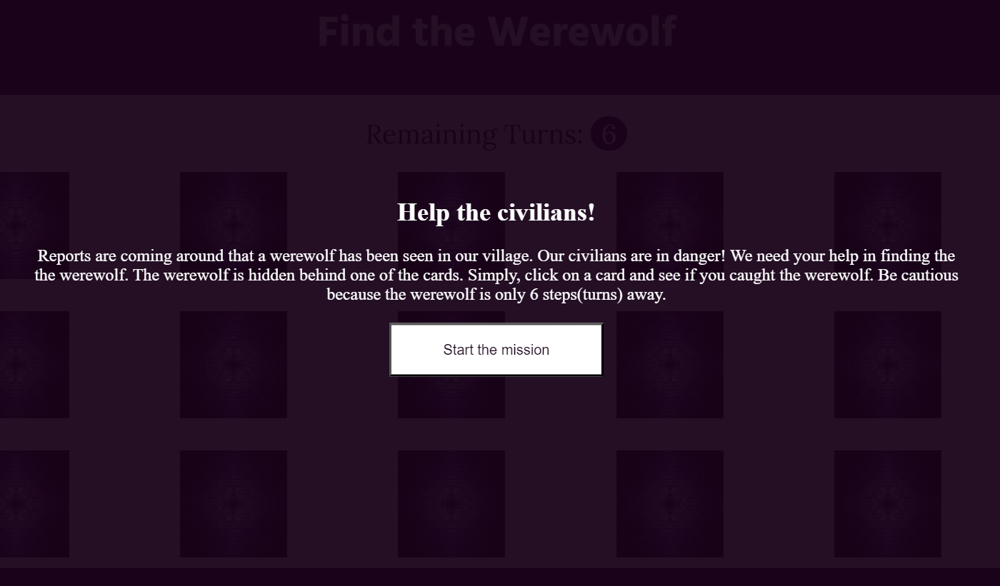
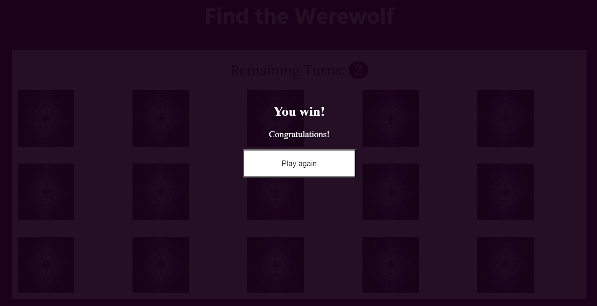
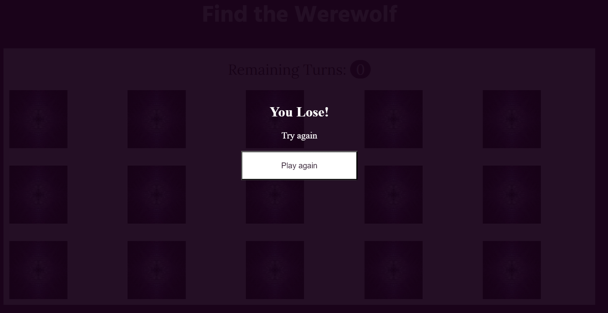
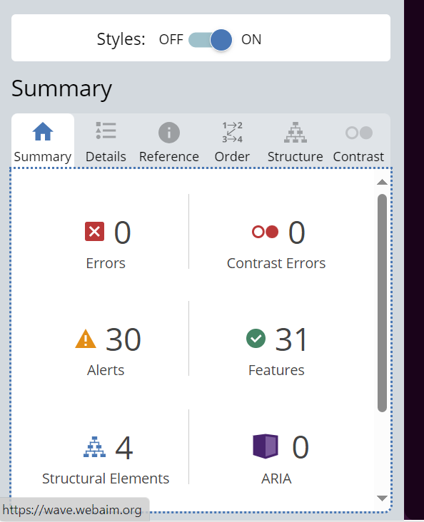
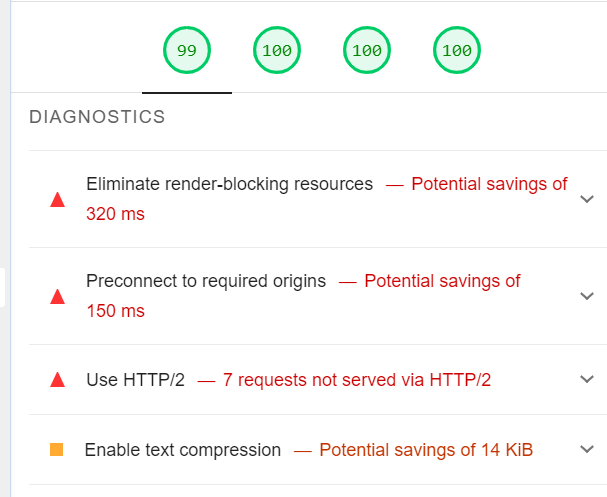
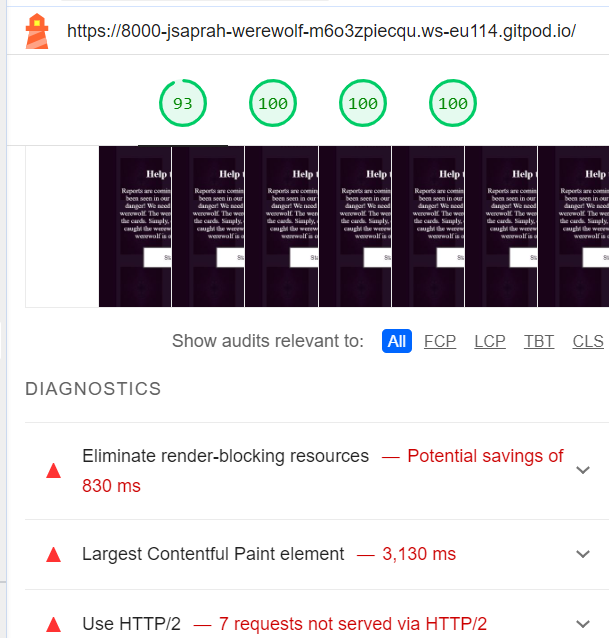
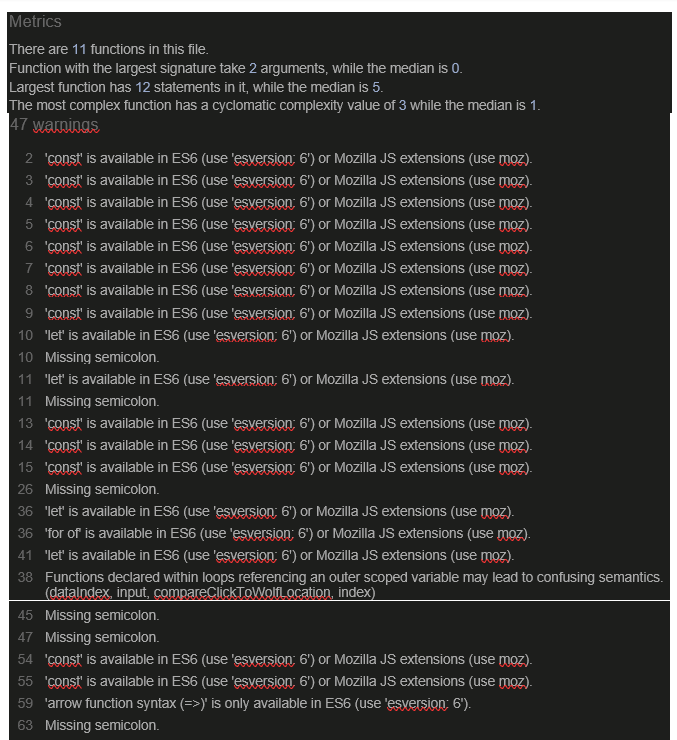
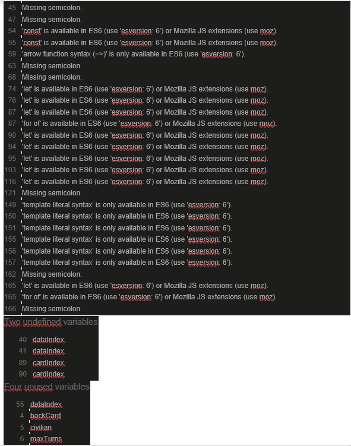

# **The Werewolf**

## **Site overview**

This project is inspired by the Werewolf by Stellar Factory. This game was introduced to me on the work floor few months ago. This is a roleplay game and can be played with more or less roles. The main roles (and the basic version) is of the werewolf and the civilians. At night time the werewolf wakes up and kills one civilian. At day time the civilians can mutually guess who they think the werewolf is. If they find the werewolf the civilians win. If not, the werewolf wins. 

For this project I have chosen for the simplified version, because of the fact that this is a roleplay game and it should actually be played together in a room. Next to that I am fulfilling this project based on the given requirements and the time constraints.

## **Process**

## **Requirements**

* As a user I want a small introduction to the game
* As a user I want the cards to be in a random order
* As a user I want to have a maximum number of turns to be six
* As a user I want the game to end when the turns are over or when I have made the right guess
* As a user I want the cards to be not visible at first. These should only be visible on click of the card

## **Wireframing**

## **Site overview**

## ***Game***

The game consists of some cards. Upon clicking a card, the card is made visible. It's flipped around. The game can end in two situations. 
1. The wolf is found
2. Turns left is over

In both cases the user gets an option to play again. 

## ***Modal***

The modal text has been setup in html once. In JavaScript literals are used to change the text based on if the user won or lost with the option to play again.

## **Structure and style with HTML and CSS**

The HTML and the css part in this project are kept as simple, but functional as possible. 
The HTML part contains: 
* Main class gaming container with div gaming canvas containing:
    * Score canvas: for the remaining turns
    * Controls canvas: container for all cards containing the front and the back of the image.
* Section modal for information text on load of the screen and for game over, play again.

The CSS file contains
* First part contains the general designing rules for lay-out, colours, fonts etc.
* Second part covers the flipping of the cards
* The part part is the styling of the modal

## **JavaScript structure**

### **Variables**
Constant variables to retrieve classes and id's from html to manipulate the dom and reuse them throughout the script.

### **Event listener**

* Event listener on load of the page DOMContentLoaded
    * The display property in css has been set to none which hides the modal. In this event listener the hide option is removed so the user sees the modal.
    * It runs the runGame() function.

### **Functions**

* runGame()
    * Loops through all the cards - div inputs.
        * Add event listener upon click of the cards.
        * Gets the data-index value of the cards and puts that in an array
        * Runs the function compareClickToWolfLocation() with two parameters - data-index and correctAnswer

* handleInput()
    * Retrieves the maximum turns and runs the function minusTurn with the remainingTurns as a parameter.
    * Seperated this function from the runGame functionality so that the refresh goes well

* GenerateRandomNumber()
    * Generate a random number
    * Assigns the wolf to index 1
    * Returns the index of the wolf
    * Calls for the function addWolfImage

* addWolfImage (index)
    * Gets the index value from GenerateRandomNumber
    * Add wolf image to index 1
    * Added else statement so that it reverts all images that dont match the index number back to a civilian

* minusTurn(turnsCount)
    * Gets the turnsCount as a parameter of the function
    * Decreases the count of turns left. If the turns left is more than 1
    * If the turns left is less than 1 it opens the modal for Game over

* correctResponse(index)
    * Gets the index as a parameter of the function
    * Returns the correct response

* compareClickToWolfLocation(dataIndexArray, correctAnswer)
    * Gets the dataIndexArray  and correctAnswer as a parameter of the function
    * Compares the correct answer with the selected answer/ clicked card by the user

* closeModal()
    * Hides the modal on click of the button in the modal
    
* openModal()
    * Opens the modal in case if the turns are over or the wolf card is found
    * Change the text based on user guesses the right answer or remaining turns are over.
    * Remove eventListeners to prevent more being added on top of each other
    * Event listener for the play again button so that the user has the option the play again. This runs the runGame functionality.

## **Testing**

Testing has been conducted throughtout the project and after finishing the project. Testing has been done manually, using different browsers and devices and via the tools: JSHint, W3C validators.

## **Issues faced during the project**

|Issue|Solution|
|-------------|-------------|
|Issue 28 cards were returning |I added another class on div level to avoid both front back being counted|
|I added same ID for both werewolf front and back. Realised that ID should be unique. This was causing the issue that JavaScript was returning null value|Added a different id for front and back|
|Random number did not give me back unique values|Using set solved my issue|
|Cards did not have a unique value because of this I was not able to compare |Added data-index so that the cards can have a unique value|
|I needed to pass two paramaters for compareClickToWolfLocation. The parameters were coming from different functions, because of this reason I was not able to pass it.|I had functions calling other functions which became really messy. I had to reorganise the structure and put more code in the runGame function. From there I was able to pass two paramaters to compareClickToWolfLocation function.|
|Remaining turns not updating| Added the handleInput functionality as the previous game count still was taken. Removed the event listener to prevent this from happening|
|Play again generated a new random number, but the image was still of a wolf|Changed back the images by adding an else statement to addWolfImage() function so that it sets back all the images which are not equal to the index number back to a civilian.|

## **Manual**

Issues were found when testing in the browser Safari. It appeared that the backface-visibilty functionality was not supported. As a way-around I tried adding z-index, perspectives and the extension -webkit. Nothing helped, therefore I added the functionality "input.classList.add('is-flipped');"in JavaScript. As the cards were not flipping around I removed the class with a delay. 

## **Automated testing**

No errors were found for the HTML part and the CSS part of the code.

## ***W3C HTML***

## *** W3C CSS***

## ***Wave***

## ***Lighthouse***
Performance and percentage for SEO were improved by:
* Adding meta-description to the HTML document
* Converting images for png to webp

The images below show the before and test before and after the changes were made. The percentages are almost for all categories 100%. 

  
  
  

## ***JavaScript***

JSHint returned:

* Warning: These are kept unresolved. 
* Missing semicolons: Added these
* Two variables not defined: These were missing the keyword let. I have added for both of them
* Unused variables: Deleted the unused variables

  
  

## **Resources**

## ***Testing***
* JSHINT: [JSHint](https://jshint.com/)
* Wave: [Wave](https://wave.webaim.org/help)  
* W3C: [W3C](https://validator.w3.org/)  
* Lighthouse: via developers tools.  
* Jigsaw W3 CSS validator: [Jigsaw](https://jigsaw.w3.org/css-validator/)  

## ***Coding***
* [StackOverflow](https://stackoverflow.com/)
* [Flipcards](https://www.w3schools.com/howto/howto_css_flip_card.asp)

## ***Media***
* Fonts: [Google fonts](https://fonts.google.com/)  
* Help with selecting the font: [Joyfont](https://fontjoy.com/)  
* Icons: [FontAwesome](https://fontawesome.com/)  
* Images: [Pexels](https://www.pexels.com/)  
* Formatting images to webp: [Ezgif](https://ezgif.com/png-to-webp)  

## **Unresolved bugs**
* The modal appears too fast, because of this reason the wolf image is not fully visibile. The could be solved with the setTimeOutFunction. 

## **Future enhancements** 

* Adding more roles the cards to come closer to the roleplay of stelllar
* Make it more challening with levels